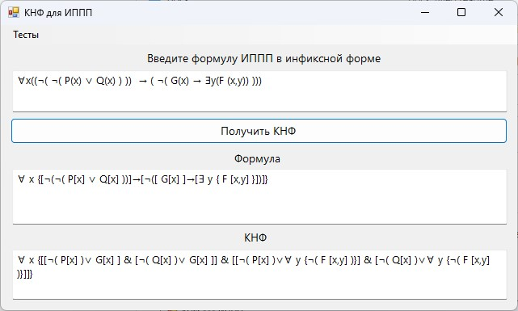

# PredicatesKHF

An application that allows you to transform an arbitrary first-order predicate calculus formula into conjunctive normal form.

App include tests for examples of work.

The application parses the infix record of the formula into a tree, which is then used to launch dfs to convert it to CNF.

The code is written based on OOP principles. The class diagram is in the screenshot below.

